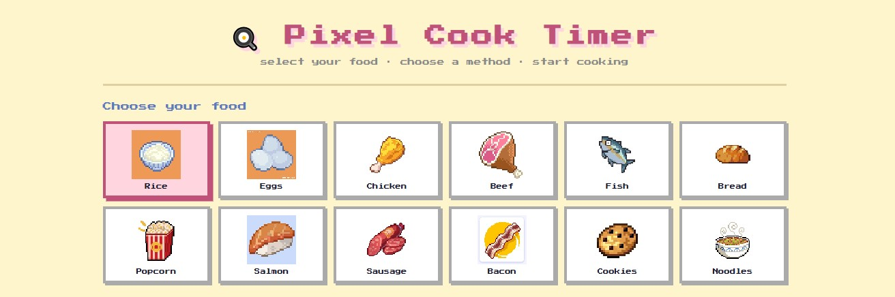
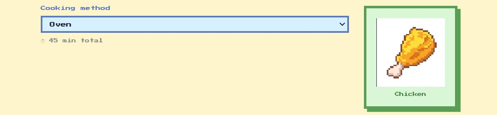
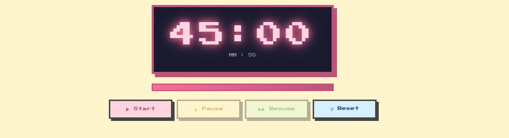

#  PixelCook Timer

A cute and minimal pixel art cooking timer designed for quick and easy use in the kitchen. Perfect for cooking, baking, or any daily task that needs timing.

##  Features

-  Pixel art design  
-  Simple countdown timer  
-  Alarm when time is up  
-  Clean and minimal UI  

##  How to Use

1. Open the app  
2. choose the type of food
   
   
   
4. choose the cooking style
   
   
    
6. start your alarm
     
8. wait for it to ring
   

